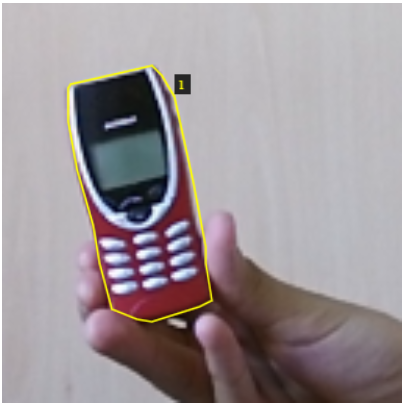
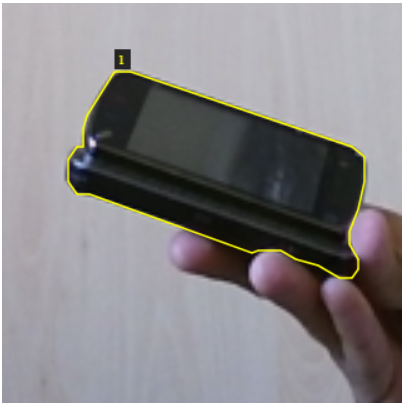
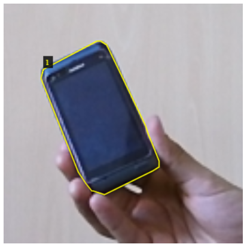
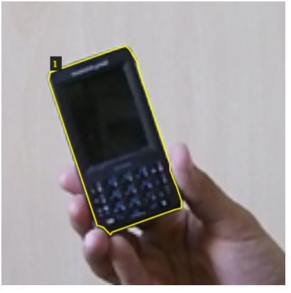

# auggi-assignment

"Using the CORE50 dataset (core50 link), please compose, train and test an image segmentation algorithm to detect the object "mobile phone". Just to clarify, this is a convolutional neural network that takes an RGB image and spits out a black&white image: the area where the mobile phone is should be in white and the rest should be black. "

### Summary:
I. Implementing a pretrained model: Mask RCNN

We are going to use a pretrained image segmentation network called Mask-RCNN and used the pretrained model on COCO dataset. This is really convenient, especially because they are mobile phone photos in COCO dataset. so the network is already capable to segmentate cell phones.

II. Train the model on CORE50 'mobile phone' photos

III. Building test script to test the model on webcam

#### I. Implementing a pretrained model: Mask RCNN

In order to compose annd to train a segmentation network to recognize mobile phones, it is possible to use a pre-trained model. In my case, I chose to use Mask R-CNN (regional convolutional neural network) which is a two stage framework: the first stage scans the image and generates proposals(areas likely to contain an object). And the second stage classifies the proposals and generates bounding boxes and masks. 
Firstly, I used transfer learning. This means that, instead of training a model from scratch, I started with a weights file that’s been trained on the COCO dataset. The COCO dataset contains a lot of other images (~120K), so the trained weights have already learned a lot of the features common in natural images.

The pre-trained weights (trained on MS COCO) file "mask_rcnn_balloon.h5" was too large and I couldn't upload it to the github repository. For the program to work, the file need to be downloaded at this link (https://github.com/matterport/Mask_RCNN/releases) and pasted in the samples folder of the Mask_RCNN repository.

Fortunately, the coco dataset has a "cell phone" class, so the Mask R-CNN with the weights file from training on the COCO dataset is capable to classify, detect and segmentate cell phones in images.

Some image segmentation results on Core50 are showed below:

 

 

 

 

More details on the code implementing Mask R-CNN are in the notebook file: "\Mask_RCNN\samples\mrcnn.ipynb"

Note: The setup of Mask R-CNN took quite a long time, this is not only because of the libraries that need to be used, but also because some libraries required specific older versions. For instance, I needed to downgrade tensorflow and Keras to older versions.

Resources like this is a combination of luck and randomness. It is possible to imagine situations in which we would like to segmentate objects that Mask R-CNN or any public network has never been trained to. In this case, we would need to train the network to learn how to segmentate very particular class of objects. 
At auggi for instance, I suppose a network has been trained to classify, detect and segmentate stool from images. Due to lack of image dataset on stool, it can be more complicated to train a network to recognize some objects than others. 

#### II. CORE50 mobile phone training photos

Let's suppose now that Mask R-CNN has never been trained on cell phones, how can we train this network on Core50 mobile phone photos?
There is an excellent resource explaining how this can be done by matterport here (https://engineering.matterport.com/splash-of-color-instance-segmentation-with-mask-r-cnn-and-tensorflow-7c761e238b46).

The article explains that they would like to train the Mask R-CNN to recognize "balloons", which is an object class that Mask R-CNN has never learned to detect. 
For the network to learn to detect balloons, the principle is the same as every machine learning algorithm. The network need to minimize its loss function over the learning process. In image segmentation, mIoU (mean interception over union) is a common metric used to calculate the loss function. The IoU is the ratio between the area of overlap and the area of union between the ground truth and the predicted areas. The mIoU is the average between the IoU of the segmented objects over all the images of the test dataset. Image pixel wise annotation is crucial for image segmentation learning process since it is used to calculate the mIoU. 
However, the Core 50 dataset does not contain pixel annotation for the objects in the images. There are therefore several options to train the network.

##### II. 1) Depth images of the Core50 dataset.

Although the core 50 dataset does not contain the pixel annotation of the object in its images, the Core50 dataset does contain image depth information, which can easily help users to extract and to seperate background from the object and the hand holding the object. However, we want to train a network that is capable of detecting and segmenting mobile phone in any images even when the depth information of the images is not available.

Firstly, an algorithm has been used to discard all pixels belonging to the background. Secondly, an SVM classifier is used to discard the user's hand from the image to only keep the object's pixel in the image. The process is explained in this Github: https://github.com/giacomobartoli/core50_segmentation

This is a pretty efficient way to annotate the images. Unfortunately, the image segmentation results from this process is quite approximated. If we use these results as a the reference to compute the mIoU, it would be the equivalent of using an approximate version of solutions to grade homework, the results will only be even more approximate.Therefore, this is not a feasible option.

##### II. 2) Manual pixel annotation
The author downloaded 75 photos of balloons on Flickr and annotate the balloons area on the images with VGG Image Annotator (VIA) (http://www.robots.ox.ac.uk/~vgg/software/via/). 
In our case, Core50 has 11 sections of short videos of 50 objects. For mobile phones, there are 5 mobile phones in each section and for each phone there are around 300 frames that were recorded. Therefore, there are in total 11*5*300 = 16500 photos of mobile phone in Core50 dataset. Due to the time constraints, the pixel annotation on every image was not a feasible option, but here are some annotated images for illustration purposes:

 

 

Once these photos annotated, they have been exported in a JSON file, and can be further used to train the network.
In reality, I would imagine that this is the way stool images are annotated. I've also found the paper that was written by auggi's founders David Hachuel and Alfonso Martinez: https://arxiv.org/ftp/arxiv/papers/1903/1903.10578.pdf. The image annotation process was completed using the online collaborative platform Labelbox(www.labelbox.com).

#### III. Building test script to test the model on webcam
To build the test script to test the model on a webcam, I have followed this article, where the author explained how to do a real time image segmentation using Mask R-CNN.
After modifying the real time segmentation python file, the notebook file 'Real_time_segment.ipynb' has been created in order to run the real time image segmentation file on a computer's webcam.

#### Conclusion:

In this assignment, I started by exploring the popular image segmentation networks Mask R-CNN that have been pre-trained on the popular COCO dataset. Fortunately, the COCO dataset contains mobile phone pictures, and Mask R-CNN was therefore capable of completing image segmentation on mobile phone. Then, I assumed that Mask R-CNN has never been trained on mobile phone pictures and try to understand what would have needed to be done and there were several options. Annotating manually the images is the most time-consuming but also the most realistic way to annotate images on the pixel level. Once the images were annotated, it is possible to train the network to recognize new objects. Finally, a real time segmentation python file was composed to test the network on webcams.

To conclude, I would like to thank auggi for having given me this opportunity to work on this assignment, I have enjoyed working on this subject, searching for relevant articles and I have learned a lot.

### Resources:

1) CORe 50 dataset: https://vlomonaco.github.io/core50/index.html#dataset

2) Mask RCNN: https://github.com/matterport/Mask_RCNN/releases

3) Implementation of Mask R-CNN: https://www.analyticsvidhya.com/blog/2019/07/computer-vision-implementing-mask-r-cnn-image-segmentation/?utm_source=blog&utm_medium=introduction-image-segmentation-techniques-python

4) Training Mask R-CNN on new objects: https://engineering.matterport.com/splash-of-color-instance-segmentation-with-mask-r-cnn-and-tensorflow-7c761e238b46

5) Real time image segmentation with Mask R-CNN: https://www.akshatvasistha.com/2019/10/how-do-real-time-image-segmentation-mask-rcnn.html

6) VGG image annotator: http://www.robots.ox.ac.uk/~vgg/software/via/

7) Augmenting Gastrointestinal Health: A Deep Learning Approach to Human Stool Recognition and Characterization in Macroscopic Images: https://arxiv.org/ftp/arxiv/papers/1903/1903.10578.pdf
